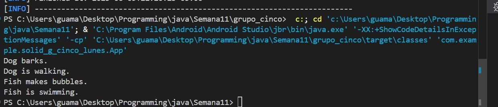

# Sesión 28 - 29 - 30: Actividad Integral sobre los Principios SOLID

## Información del Grupo
**Grupo N°:** 5
**Integrantes:**
- David Guamán 
- Jefferson Ruiz   
- Anderson Guaman
- Carlos Ochoa 
---

## Reflexión sobre la Implementación de SOLID
El principal problema al momento de implementar los principios SOLID fue la necesidad de comprender la función y objetivo del código. El segundo problema que se dió solución durante la resolución de los ejercicio es que fue necesario complementar las falta de comprensión de algunos miembros del grupo respecto a ciertos temas. Dado que no todos programaban en Java fue necesario experimentar y arreglar errores en el código para su correcto funcionamiento.

## Evidencias de la ejecución
### Single Responsibility Principle (SRP):

### OpenClosed Principle (OCP):

### Liskov Substitution Principle (LSP):

### Interface Segregation Principle (ISP):

### Dependency Inversion Principle (DIP):

---

## Reflexión Personal
### Estudiante: David Guaman
#### ¿Cuál fue el principio más desafiante de aplicar? ¿Por qué?
En mi opinión DIP fue el principio más desafiante porque requiere cambiar la forma en la programamos, programando tal que las clases de alto nivel dependan de las de bajo nivel.
Además, requiere de refactorización de código dado que algunas abstracciones no son obvias al inicio del proyecto.
Por último, requiere un profundo entendimiento del código dado que el cambio de una dependencia o clase modifica a la estructura del sistema.
#### ¿Cómo crees que SOLID mejora el diseño de software?
Los principios SOLID permiten establecer las bases para programar con conciencia y bajo principios lógicos claros. En mi opinión, los principios SOLID pueden mejorar la calidad del código cuando se aplican bien. No obstante, utilizar estos principios sin consciencia ni la comprensión necesaria de cuando es necesario aplicarlos afectará la mantenibilidad y limpieza del código.
#### ¿Específicamente qué principio SOLID aplicarías de lo aprendido, en futuros o actuales proyectos?
Aplicaría SRP para la creación de clases basadas en el dominio y para la creación de servicios para APIs. También, utilizaría DIP para la comunicación entre servicios y para facilitar la creación de mocks para testing.

---
### Estudiante: Anderson Guaman
#### ¿Cuál fue el principio más desafiante de aplicar? ¿Por qué?
Inversión de Dependencias (DIP). En el proyecto de pagos, depender de CreditCardPayment fue un lío. Crear la interfaz PaymentMethod y usarla en PaymentProcessor me costó entender al inicio, pero luego vi cómo facilitó agregar PayPalPayment sin romper nada.
#### ¿Cómo crees que SOLID mejora el diseño de software?
SOLID hace el código flexible y claro. En el sistema de pagos, usar DIP permitió cambiar métodos de pago sin modificar PaymentProcessor. Esto ahorra tiempo, reduce errores y hace que el código sea más fácil de probar y mantener.
#### ¿Específicamente qué principio SOLID aplicarías de lo aprendido, en futuros o actuales proyectos?
Responsabilidad Única (SRP). Separé PaymentProcessor de la lógica de pagos en el proyecto, usando PaymentMethod. Esto hizo el código más claro y fácil de probar. Lo aplicaré en mi tesis para evitar clases sobrecargadas y mantener todo organizado. 

---
### Estudiante: Jefferson Ruiz
#### ¿Cuál fue el principio más desafiante de aplicar? ¿Por qué?
El LSP, porque fue difícil evitar que las subclases rompieran el comportamiento esperado al reemplazar a la clase base.
#### ¿Cómo crees que SOLID mejora el diseño de software?
Hace el código más claro, modular y fácil de mantener o extender sin romper lo existente.
#### ¿Específicamente qué principio SOLID aplicarías de lo aprendido, en futuros o actuales proyectos?
El OCP, porque permite agregar nuevas funciones sin modificar el código ya escrito, evitando errores.

---
### Estudiante: Carlos Ochoa
#### ¿Cuál fue el principio más desafiante de aplicar? ¿Por qué?
El mas desafiante fue el principio DIP, me resulto complicado entender como desacoplar los modulos, al principio no es tan intuitivo pero no es tan complejo una vez le entiendes.
#### ¿Cómo crees que SOLID mejora el diseño de software?
SOLID mejora el diseño de software al hacerlo más modular, escalable y fácil de mantener. Permite reutilizar componentes y escribir pruebas automatizadas más efectivas, lo que mejora la calidad general del proyecto.
#### ¿Específicamente qué principio SOLID aplicarías de lo aprendido, en futuros o actuales proyectos?
Aplicaria especialmente el SRP, ya que esto ayuda mucho a que las clases hagan 1 sola cosa y  es mas facil de mantener.